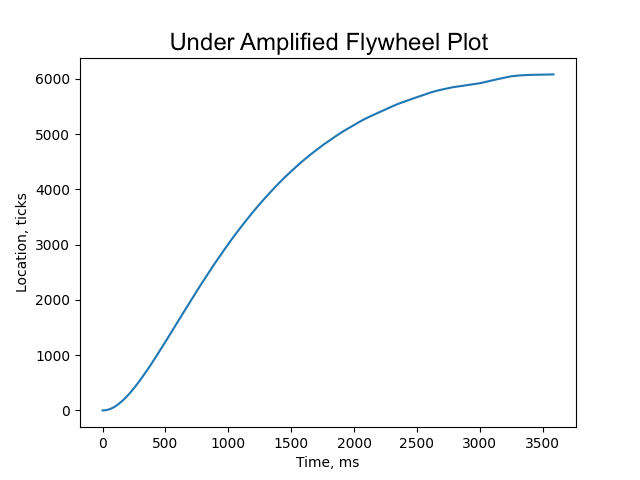

# Closed-Loop Motor Controller

### Closed Loop Controller
The controller presented in this lab works by means of repeatedly calling
the function `run(desired, actual)` on the instantiated motor controller object.
This function computes the difference between the desired and actual angular
displacements of the motor, then multiplies this value by a user defined gain,
Kp, to obtain a PWM value. This value may then be fed into a Motor Driver object,
as defined in the **motor_driver.py** class file. The desired position is user
defined, while the actual position is returned by means of an Encoder Reader
object, as defined in the **encoder_reader.py** file.

### Motor Driver
The motor driver class is responsible for instantiating the driving pins used to
operate the motor, and for updating the PWM signal used to drive the motor by
means of the `set_duty_cycle(level)` function. When updated adequately quickly
by the closed loop controller, it is possible to drive the motor to a given
angular displacement by means of varying the velocity alone.

### Encoder Reader
The encoder reader class is responsible for instantiating the input pins used to
detect changes in motor position. The board's onboard counter is able to detect
and store up to 4000 unique positions (corresponding to one half revolution of
the motor), while the absolute displacement is managed by the class. The `read()`
function is able to track changes in angular displacement and compare them to
the previously stored value, and updates the displacement accordingly. The
function prevents against auto-reload related counter errors by comparing the
change in position to (AR + 1)/2. As long as the function is run adequately
quickly (100 times per second or more), this comparatively large displacement
will catch overflow/underflow in the counter.

### Step Response Plotter
The step response plotter recieves data transmitted from the MCU over the
serial port to the PC. The MCU sends both time and positioning data read by the
internal clock and the encoder from the **encoder_reader.py** over the ST-Link.
The PC opens the serial port off COM11 and reads the time and positioning data 
sent from the MCU. The program reads from the serial port until given a command 
to stop, which it then transitions to plotting the recieved data.

### Main
The main function interfaces with the MCU and sends commands to run the motor. 
By providing a Kp value to the **main.py**, the motor uses the 
**encoder_reader.py** to determine its position and uses a simple proportional
gain model to control the motor.

## Plots
In order to evaluate the response of the motor controller, three plots were 
created; the first plot (Figure 1), of critically amplified flywheel response was modeled 
with a Kp of 0.005. The figure 2 illustrates the motor's responce to a high Kp
value of 0.1, generating excessive oscillation in the flywheel. The final plot,
figure3, is that of an underdamped system, which has the characteristic slow response
expected of the low proportional gain of 0.02.

Figure 1

Figure 2

Figure 3